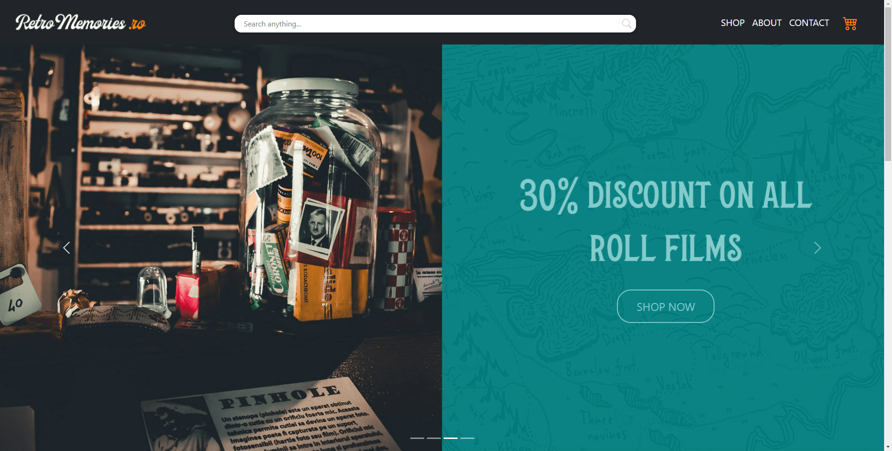
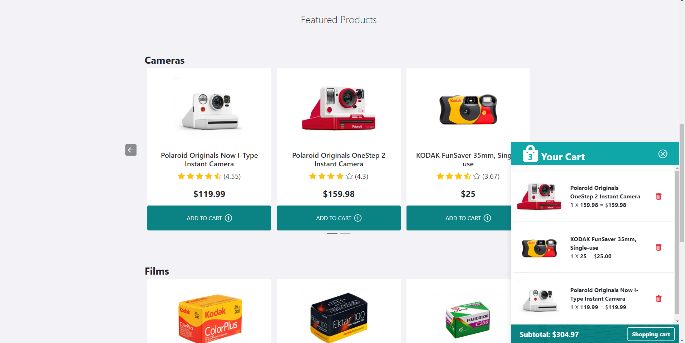
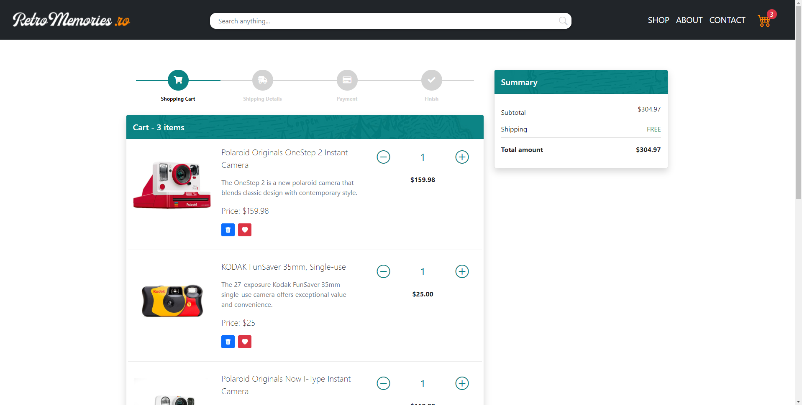
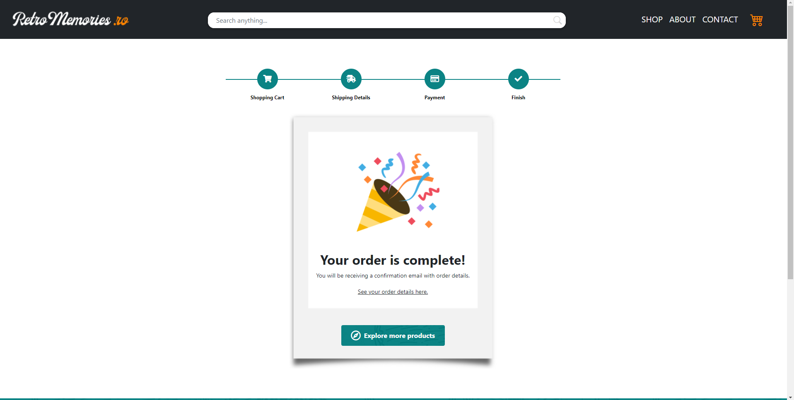

<!-- PROJECT LOGO -->
 

  

  <h3 align="center">Camera Shop Javascript Project</h3>

  

    <a href="https://retro-memories.netlify.app/">View Demo</a>
    |
    <a href="https://github.com/AlexandruAnastasiu">Contact</a>
  

<!-- TABLE OF CONTENTS -->

  
Table of Contents

  <ol>
    <li>
      <a href="#about-the-project">About The Project</a>
      <ul>
        <li><a href="#built-with">Built With</a></li>
      </ul>
    </li>
    <li>
      <a href="#getting-started">Getting Started</a>
      <ul>
        <li><a href="#installation">Installation</a></li>
      </ul>
    </li>
    <li><a href="#usage">Usage</a></li>
    <li><a href="#contact">Contact</a></li>
    <li><a href="#acknowledgments">Acknowledgments</a></li>
  </ol>

<!-- ABOUT THE PROJECT -->
## About The Project

This application simulates an online camera store, with various features such as a shopping cart, a multi-step form for ordering details and a working search bar for in-store products.
This project was made as part of an evaluation of the first ZegaSoftware bootcamp, using only: 
* HTML
* CSS + Bootstrap
* Javascript
 

(<a href="#top">back to top</a>)

### Built With
Frameworks:
* [Bootstrap](https://getbootstrap.com)

(<a href="#top">back to top</a>)

### Installation
...Instalation Steps...

<!-- USAGE EXAMPLES -->
## Usage
The usage is easy and efficient, the functionalities being created in an intuitive way, simulating in detail the interaction with an online store

Featured Products:

Shopping Cart:

(<a href="#top">back to top</a>)

Purchase:

<!-- CONTACT -->
## Contact

Anastasiu George-Alexandru - alexandru.anastasiu@yahoo.com

Project Link: [https://github.com/AlexandruAnastasiu/camera-shop](https://github.com/AlexandruAnastasiu/camera-shop)

(<a href="#top">back to top</a>)

<!-- ACKNOWLEDGMENTS -->
## Acknowledgments

* [Bootstrap Docs](https://getbootstrap.com/docs/5.0/getting-started/introduction/)
* [GitHub Pages](https://pages.github.com)
* [Bootstrap Icons](https://icons.getbootstrap.com/)

(<a href="#top">back to top</a>)

